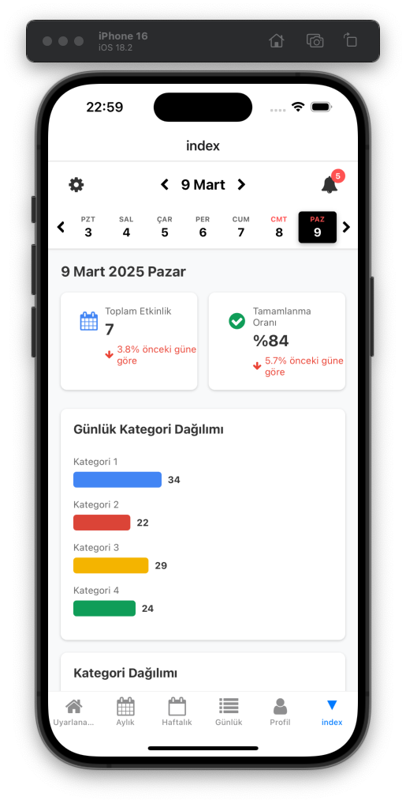

# Expo Calendar

Expo ile oluşturulmuş, özelleştirilebilir ve kullanımı kolay bir takvim uygulaması.



## Kurulum

Paketi kurmak için aşağıdaki komutu kullanabilirsiniz:

```bash
npm install @canakyuz/calendar
```

veya

```bash
yarn add @canakyuz/calendar
```

## İçindekiler

- [Genel Bakış](#genel-bakış)
- [Bileşenler](#bileşenler)
  - [Calendar](#calendar-ana-bileşen)
  - [DailyView](#dailyview-günlük-görünüm)
  - [WeeklyView](#weeklyview-haftalık-görünüm)
  - [MonthlyView](#monthlyview-aylık-görünüm)
  - [CalendarHeader](#calendarheader-takvim-başlığı)
  - [DateSelector](#dateselector-tarih-seçici)
- [Temalar](#temalar)
- [Minimal Mod](#minimal-mod)
- [Örnekler](#örnekler)
- [Geliştirme](#geliştirme)
- [Sürüm Notları](#sürüm-notları)
- [Lisans](#lisans)

## Genel Bakış

@canakyuz/calendar paketi, React Native ve Expo projeleri için tam özelleştirilebilir bir takvim çözümüdür. Ana bileşen olan Calendar'ı kullanarak başlayabilir veya alt bileşenleri ihtiyaçlarınıza göre ayrı ayrı kullanabilirsiniz.

Paket, aşağıdaki görünüm modlarını destekler:

- **Günlük Görünüm**: Tek bir günün detaylı incelemesi
- **Haftalık Görünüm**: Bir haftanın genel görünümü
- **Aylık Görünüm**: Tam ay takvimi
- **Minimal Mod**: Sadece temel takvim işlevselliği için optimize edilmiş hafif versiyon

## Bileşenler

### Calendar (Ana Bileşen)

Calendar, paketin ana bileşenidir ve tüm görünüm modlarını ve özellikleri içerir.

```jsx
import React from 'react';
import { View } from 'react-native';
import { Calendar } from '@canakyuz/calendar';

export default function CalendarExample() {
  const handleDateSelect = (date) => {
    console.log('Seçilen tarih:', date);
  };

  return (
    <View style={{ flex: 1 }}>
      <Calendar 
        date={new Date()} 
        onDatePress={handleDateSelect}
        view="weekly" // 'daily', 'weekly', 'monthly' veya 'agenda'
        theme={{
          primaryColor: '#3498db',
          textColor: '#333',
          todayColor: '#e74c3c',
          selectedDayColor: '#2980b9'
        }}
        tasks={[
          {
            id: '1',
            title: 'Toplantı',
            startTime: new Date(2023, 9, 15, 10, 0),
            endTime: new Date(2023, 9, 15, 11, 30),
            color: '#e74c3c'
          },
          {
            id: '2',
            title: 'Öğle Yemeği',
            startTime: new Date(2023, 9, 15, 12, 0),
            endTime: new Date(2023, 9, 15, 13, 0),
            color: '#2ecc71'
          }
        ]}
      />
    </View>
  );
}
```

#### Calendar Props

| Prop | Tip | Varsayılan | Açıklama |
|------|-----|------------|----------|
| date | Date | Bugün | Takvimin göstereceği tarih |
| view | 'daily' \| 'weekly' \| 'monthly' \| 'agenda' | 'weekly' | Takvimin görünüm modu |
| tasks | Task[] | [] | Gösterilecek etkinlikler dizisi |
| onDatePress | (date: Date) => void | - | Bir tarih seçildiğinde çalışacak fonksiyon |
| onTaskPress | (task: Task) => void | - | Bir etkinliğe tıklandığında çalışacak fonksiyon |
| theme | ThemeProps | {} | Takvimin teması |
| minimalMode | boolean | false | Minimal modu aktifleştirir |
| compact | boolean | false | Kompakt görünüm modunu aktifleştirir |
| showHeader | boolean | true | Takvim başlığını gösterir/gizler |
| showNavigation | boolean | true | Navigasyon düğmelerini gösterir/gizler |
| renderDayContent | (date: Date, events: Task[]) => React.ReactNode | - | Özel gün içeriği renderlamak için fonksiyon |
| logoSource | any | - | Sol üstteki logo için kaynak |
| notificationIcon | React.ReactNode | - | Sağ üstteki bildirim ikonu |
| renderLogo | () => React.ReactNode | - | Özel logo render fonksiyonu |
| renderNotification | () => React.ReactNode | - | Özel bildirim ikonu render fonksiyonu |
| renderHeader | () => React.ReactNode | - | Özel başlık render fonksiyonu |
| hideNotification | boolean | false | Bildirim ikonunu gizler |
| hideLogo | boolean | false | Logoyu gizler |

### DailyView (Günlük Görünüm)

DailyView, tek bir günün detaylı görünümünü sağlar.

```jsx
import React from 'react';
import { View } from 'react-native';
import { DailyView } from '@canakyuz/calendar';

export default function DailyViewExample() {
  return (
    <View style={{ flex: 1 }}>
      <DailyView
        date={new Date(2023, 9, 15)}
        tasks={[
          {
            id: '1',
            title: 'Sabah Toplantısı',
            startTime: new Date(2023, 9, 15, 9, 0),
            endTime: new Date(2023, 9, 15, 10, 0),
            color: '#9b59b6'
          }
        ]}
        onTaskPress={(task) => console.log('Seçilen etkinlik:', task)}
        onDatePress={(date) => console.log('Seçilen tarih:', date)}
        theme={{
          backgroundColor: '#fff',
          textColor: '#333'
        }}
        hourRange={{ start: 8, end: 20 }} // 08:00 - 20:00 arası görünüm
      />
    </View>
  );
}
```

#### DailyView Props

| Prop | Tip | Varsayılan | Açıklama |
|------|-----|------------|----------|
| date | Date | Bugün | Gösterilecek gün |
| tasks | Task[] | [] | Gösterilecek etkinlikler |
| onTaskPress | (task: Task) => void | - | Etkinliğe tıklandığında çalışacak fonksiyon |
| onDatePress | (date: Date) => void | - | Tarihe tıklandığında çalışacak fonksiyon |
| theme | ThemeProps | {} | Görünüm teması |
| hourRange | { start: number; end: number } | { start: 0, end: 24 } | Görüntülenecek saat aralığı |

### WeeklyView (Haftalık Görünüm)

WeeklyView, bir haftanın genel görünümünü sağlar.

```jsx
import React from 'react';
import { View } from 'react-native';
import { WeeklyView } from '@canakyuz/calendar';

export default function WeeklyViewExample() {
  return (
    <View style={{ flex: 1 }}>
      <WeeklyView
        date={new Date(2023, 9, 10)}
        tasks={[
          {
            id: '1',
            title: 'Haftalık Toplantı',
            startTime: new Date(2023, 9, 12, 14, 0),
            endTime: new Date(2023, 9, 12, 15, 30),
            color: '#3498db'
          }
        ]}
        onTaskPress={(task) => console.log('Seçilen etkinlik:', task)}
        onDatePress={(date) => console.log('Seçilen tarih:', date)}
        theme={{
          backgroundColor: '#f9f9f9',
          textColor: '#333'
        }}
        hourRange={{ start: 9, end: 18 }} // 09:00 - 18:00 arası görünüm
      />
    </View>
  );
}
```

#### WeeklyView Props

| Prop | Tip | Varsayılan | Açıklama |
|------|-----|------------|----------|
| date | Date | Bugün | Gösterilecek haftanın başlangıç tarihi |
| tasks | Task[] | [] | Gösterilecek etkinlikler |
| onTaskPress | (task: Task) => void | - | Etkinliğe tıklandığında çalışacak fonksiyon |
| onDatePress | (date: Date) => void | - | Tarihe tıklandığında çalışacak fonksiyon |
| theme | ThemeProps | {} | Görünüm teması |
| hourRange | { start: number; end: number } | { start: 0, end: 24 } | Görüntülenecek saat aralığı |

### MonthlyView (Aylık Görünüm)

MonthlyView, tam bir ay takvimi görünümü sağlar.

```jsx
import React from 'react';
import { View } from 'react-native';
import { MonthlyView } from '@canakyuz/calendar';

export default function MonthlyViewExample() {
  return (
    <View style={{ flex: 1 }}>
      <MonthlyView
        date={new Date(2023, 9, 1)}
        tasks={[
          {
            id: '1',
            title: 'Aylık Rapor',
            startTime: new Date(2023, 9, 25, 10, 0),
            endTime: new Date(2023, 9, 25, 11, 0),
            color: '#2ecc71'
          }
        ]}
        onTaskPress={(task) => console.log('Seçilen etkinlik:', task)}
        onDatePress={(date) => console.log('Seçilen tarih:', date)}
        theme={{
          backgroundColor: '#fff',
          textColor: '#333'
        }}
      />
    </View>
  );
}
```

#### MonthlyView Props

| Prop | Tip | Varsayılan | Açıklama |
|------|-----|------------|----------|
| date | Date | Bugün | Gösterilecek ay |
| tasks | Task[] | [] | Gösterilecek etkinlikler |
| onTaskPress | (task: Task) => void | - | Etkinliğe tıklandığında çalışacak fonksiyon |
| onDatePress | (date: Date) => void | - | Tarihe tıklandığında çalışacak fonksiyon |
| theme | ThemeProps | {} | Görünüm teması |

### CalendarHeader (Takvim Başlığı)

CalendarHeader, takvim başlığını ve navigasyon düğmelerini içerir.

```jsx
import React from 'react';
import { View } from 'react-native';
import { CalendarHeader } from '@canakyuz/calendar';

export default function CalendarHeaderExample() {
  return (
    <View>
      <CalendarHeader
        date={new Date()}
        onPrevious={() => console.log('Önceki')}
        onNext={() => console.log('Sonraki')}
        title="Ekim 2023"
        onTitlePress={() => console.log('Başlığa tıklandı')}
        theme={{
          headerBackgroundColor: '#f8f8f8',
          headerTextColor: '#333'
        }}
        leftContent={<CustomLeftComponent />} // Özel sol içerik
        rightContent={<CustomRightComponent />} // Özel sağ içerik
        onLeftPress={() => console.log('Sol düğmeye tıklandı')}
        onRightPress={() => console.log('Sağ düğmeye tıklandı')}
      />
    </View>
  );
}
```

#### CalendarHeader Props

| Prop | Tip | Varsayılan | Açıklama |
|------|-----|------------|----------|
| date | Date | Bugün | Başlıkta gösterilecek tarih |
| onPrevious | (newDate?: Date) => void | - | Önceki düğmesine tıklandığında çalışacak fonksiyon |
| onNext | (newDate?: Date) => void | - | Sonraki düğmesine tıklandığında çalışacak fonksiyon |
| title | string | - | Özel başlık metni |
| onTitlePress | () => void | - | Başlığa tıklandığında çalışacak fonksiyon |
| theme | ThemeProps | {} | Başlık teması |
| leftContent | React.ReactNode | - | Sol tarafta gösterilecek özel içerik |
| rightContent | React.ReactNode | - | Sağ tarafta gösterilecek özel içerik |
| onLeftPress | () => void | - | Sol içeriğe tıklandığında çalışacak fonksiyon |
| onRightPress | () => void | - | Sağ içeriğe tıklandığında çalışacak fonksiyon |

### DateSelector (Tarih Seçici)

DateSelector, tarih seçimi için bir arayüz sağlar.

```jsx
import React, { useState } from 'react';
import { View } from 'react-native';
import { DateSelector } from '@canakyuz/calendar';

export default function DateSelectorExample() {
  const [selectedDate, setSelectedDate] = useState(new Date());
  
  return (
    <View>
      <DateSelector
        date={selectedDate}
        onDateChange={setSelectedDate}
        minimumDate={new Date(2023, 0, 1)} // 1 Ocak 2023
        maximumDate={new Date(2023, 11, 31)} // 31 Aralık 2023
        theme={{
          backgroundColor: '#fff',
          textColor: '#333'
        }}
      />
    </View>
  );
}
```

#### DateSelector Props

| Prop | Tip | Varsayılan | Açıklama |
|------|-----|------------|----------|
| date | Date | Bugün | Seçili tarih |
| onDateChange | (date: Date) => void | - | Tarih değiştiğinde çalışacak fonksiyon |
| minimumDate | Date | - | Seçilebilecek minimum tarih |
| maximumDate | Date | - | Seçilebilecek maksimum tarih |
| theme | ThemeProps | {} | Seçici teması |

## Temalar

Calendar bileşenlerinin görünümünü özelleştirmek için `theme` prop'unu kullanabilirsiniz. Tema nesnesi aşağıdaki özellikleri destekler:

```jsx
const theme = {
  // Genel renkler
  backgroundColor: '#ffffff', // Arka plan rengi
  textColor: '#333333', // Metin rengi
  
  // Başlık renkleri
  headerBackgroundColor: '#f5f5f5', // Başlık arka plan rengi
  headerTextColor: '#333333', // Başlık metin rengi
  
  // Gün renkleri
  selectedDayColor: '#3498db', // Seçili gün arka plan rengi
  selectedDayTextColor: '#ffffff', // Seçili gün metin rengi
  todayColor: '#e74c3c', // Bugünün rengi
  dayTextColor: '#333333', // Gün metni rengi
  dayBackgroundColor: '#ffffff', // Gün arka plan rengi
  
  // Etkinlik renkleri
  taskDefaultColor: '#3498db' // Varsayılan etkinlik rengi
};
```

## Minimal Mod

Minimal mod, takvim bileşeninin sadece temel işlevselliğini sağlayarak daha hafif ve daha az yer kaplayan bir görünüm sunar. Bu mod, kendi UI tasarımınıza entegre etmek istediğinizde idealdir.

```jsx
import React from 'react';
import { View } from 'react-native';
import { Calendar } from '@canakyuz/calendar';

export default function MinimalCalendarExample() {
  return (
    <View style={{ flex: 1 }}>
      <Calendar 
        date={new Date()}
        view="weekly"
        minimalMode={true} // Minimal modu aktifleştirir
        compact={true} // Kompakt görünüm
        showHeader={false} // Başlığı gizler
        theme={{
          backgroundColor: 'transparent',
          textColor: '#333',
          selectedDayColor: '#3498db',
          selectedDayTextColor: '#ffffff',
          todayColor: '#e74c3c',
          dayTextColor: '#333333'
        }}
        renderDayContent={(date, events) => (
          <View style={{ alignItems: 'center', padding: 5 }}>
            <Text style={{ fontWeight: 'bold' }}>{date.getDate()}</Text>
            {events.length > 0 && (
              <View style={{ width: 6, height: 6, borderRadius: 3, backgroundColor: events[0].color || '#3498db', marginTop: 2 }} />
            )}
          </View>
        )}
      />
    </View>
  );
}
```

## Örnekler

### Özelleştirilmiş Logo ve Bildirim İkonu

```jsx
import React from 'react';
import { View, Image } from 'react-native';
import { Calendar } from '@canakyuz/calendar';
import { Ionicons } from '@expo/vector-icons';

export default function CustomizedCalendarExample() {
  return (
    <View style={{ flex: 1 }}>
      <Calendar 
        date={new Date()}
        logoSource={require('./assets/my-logo.png')} // Özel logo
        notificationIcon={<Ionicons name="notifications" size={24} color="#333" />} // Özel bildirim ikonu
        // veya
        renderLogo={() => (
          <Image 
            source={require('./assets/my-logo.png')} 
            style={{ width: 30, height: 30 }}
            resizeMode="contain"
          />
        )}
        renderNotification={() => (
          <View style={{ flexDirection: 'row', alignItems: 'center' }}>
            <Ionicons name="notifications" size={24} color="#333" />
            <View style={{ width: 8, height: 8, borderRadius: 4, backgroundColor: 'red', position: 'absolute', top: -2, right: -2 }} />
          </View>
        )}
      />
    </View>
  );
}
```

### Özel Gün İçeriği Renderlamak

```jsx
import React from 'react';
import { View, Text } from 'react-native';
import { Calendar } from '@canakyuz/calendar';

export default function CustomDayContentExample() {
  return (
    <View style={{ flex: 1 }}>
      <Calendar 
        date={new Date()}
        view="monthly"
        minimalMode={true}
        renderDayContent={(date, events) => (
          <View style={{ 
            padding: 5, 
            alignItems: 'center',
            backgroundColor: date.getDay() === 0 || date.getDay() === 6 ? '#f8f8f8' : '#fff', // Hafta sonları için farklı arka plan
            borderRadius: 5
          }}>
            <Text style={{ 
              fontWeight: 'bold',
              color: date.getDay() === 0 ? 'red' : date.getDay() === 6 ? 'blue' : '#333' // Pazar için kırmızı, Cumartesi için mavi
            }}>
              {date.getDate()}
            </Text>
            
            {events.length > 0 && (
              <View style={{ marginTop: 2 }}>
                {events.slice(0, 2).map((event, index) => (
                  <View 
                    key={index} 
                    style={{ 
                      width: 8, 
                      height: 2, 
                      backgroundColor: event.color || '#3498db',
                      marginTop: 1
                    }} 
                  />
                ))}
                {events.length > 2 && (
                  <Text style={{ fontSize: 8, color: '#666' }}>+{events.length - 2}</Text>
                )}
              </View>
            )}
          </View>
        )}
      />
    </View>
  );
}
```

## Geliştirme

Yerel geliştirme için:

```bash
# Bağımlılıkları yükleyin
npm install

# Geliştirme sunucusunu başlatın
npm start
```

### Katkı Sağlama

Projeye katkı sağlamak istiyorsanız:

```bash
# Repoyu klonlayın
git clone https://github.com/canakyuz/calendar.git

# Proje dizinine gidin
cd calendar

# Bağımlılıkları yükleyin
npm install

# Geliştirme sunucusunu başlatın
npm start

# Değişikliklerinizi bir branch'te yapın
git checkout -b yeni-ozellik

# Değişikliklerinizi commit edin
git commit -m "Yeni özellik: ..."

# Branch'inizi push edin
git push origin yeni-ozellik
```

## Paket Yayınlama

Bu paket npm'de yayınlanmaktadır. Yayınlama için aşağıdaki adımları izleyin:

### Paketi Yayınlama

```bash
# Versiyonu arttırın
npm version patch  # Küçük güncellemeler için
npm version minor  # Yeni özellikler için 
npm version major  # Büyük değişiklikler için

# Paketi yayınlayın
npm publish
```

## Sürüm Notları

### 1.0.7 (Güncel)
- Minimal mod eklendi
- Özelleştirilebilir logo ve bildirim ikonları
- Özel gün içeriği renderlama özelliği
- Tema seçenekleri genişletildi
- Kompakt görünüm desteği

### 1.0.6
- TypeScript tanımlamaları iyileştirildi
- Paket ana giriş noktası düzeltildi

### 1.0.5
- İlk public sürüm

## Topluluk & Destek

Sorularınız için GitHub Issues veya aşağıdaki iletişim kanallarını kullanabilirsiniz:

- [GitHub Issues](https://github.com/canakyuz/calendar/issues)
- Twitter: [@canakyuz](https://twitter.com/canakyuz)
- E-posta: canakyuz23@outlook.com

## Güncel Versiyon

Şu anki versiyon: **1.0.7**

Son güncelleme: Mart 2024

## Lisans

Bu proje [MIT License](./LICENSE) altında lisanslanmıştır.

MIT lisansı, kullanıcıların yazılımı herhangi bir kısıtlama olmaksızın kullanma, kopyalama, değiştirme, birleştirme, yayınlama, dağıtma, alt lisanslama ve/veya satma hakkı tanıyan permisif bir lisanstır. Tek şartı, lisans ve telif hakkı bildiriminin yazılımın tüm kopyalarında veya önemli bölümlerinde bulundurulmasıdır.

Lisansın tam metnini [LICENSE](./LICENSE) dosyasında bulabilirsiniz. 